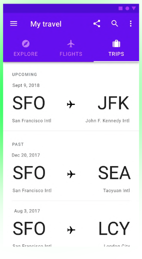

# TabLayout & ViewPager2



El ViewPager2 es una versión mejorada del viewpager normal y lo han creado para hacer más simple de
implementar. 

## Inplementación:

### Implementación 1/3

El siguiente código corresponde al componente en sí, habría que añadirlo a un fragmento o bien a un
activity. 

Para nuestro ejemplo lo ponemos en el `activity_main.xml`

```xml
<?xml version="1.0" encoding="utf-8"?>
<RelativeLayout xmlns:android="http://schemas.android.com/apk/res/android"
    xmlns:app="http://schemas.android.com/apk/res-auto"
    xmlns:tools="http://schemas.android.com/tools"
    android:layout_width="match_parent"
    android:layout_height="match_parent"
    tools:context=".MainActivity">

    <com.google.android.material.tabs.TabLayout
        android:id="@+id/tablayout"
        android:layout_width="match_parent"
        android:layout_height="wrap_content"
        style="@style/Widget.MaterialComponents.TabLayout.Colored"
        />

    <androidx.viewpager2.widget.ViewPager2
        android:id="@+id/viewpager2"
        android:layout_below="@id/tablayout"
        android:layout_width="match_parent"
        android:layout_height="wrap_content"
        />
</RelativeLayout>
```

### Implementación 2/3

El siguiente paso es crear un adapter para decir que fragments queremos utilizar en nuestra vista, 
en este caso lo podemos hacer directamente en el Activity, yo lo pondré en el `onCreate()`. También 
asignamos el apdapter al viewpager2.

```kotlin
// val myViewPager2 = findViewById<ViewPager2>(R.id.viewpager2)
// val myTabLayout = findViewById<TabLayout>(R.id.tablayout)
val myViewPager2: ViewPager2 = binding.viewpager2
val myTabLayout: TabLayout = binding.tablayout

val adapter = object : FragmentStateAdapter(this) {
    override fun getItemCount(): Int {
        return 3
    }

    // Aquí es donde abriremos un fragment cuando se pulse en uno de los tabs
    override fun createFragment(position: Int): Fragment {
        if (position == 0) {
            return BlueFragment()
        }

        if (position == 1) {
            return RedFragment()
        }

        return GreenFragment()
    }

}
myViewPager2.adapter = adapter
```

### Implementación 3/3

Por último faltaría asignar los nombres de los tabs, que con el ViewPager2 se hace de la siguiente forma:

```kotlin

```# android-tab-layout
